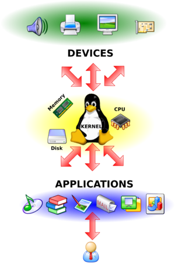

# Лабораторная работа №5. Тема: "Управление устройствами и модулями ядра"

Цель работы
----------
- Изучить основные концепции и методы управления устройствами и модулями ядра в Astra Linux;

- Провести практические эксперименты с модулями ядра и устройствами в Astra Linux.

Оборудование, ПО:
----------

Виртуальная машина или компьютер под управлением ОС AstraLinux 1.7 в режиме защищенности "Воронеж" или выше.

Ход работы:
----------

# Начнем с терминологии.

Ядро - это часть операционной системы, которая работает скрытно от пользователя системы, ведь пользователь не работает с ядром напрямую - он взаимодействует с программами и редакторами т.д.

Ядро берет на себя задачу обеспечить работу той или иной программы. Ядро имеет доступ к аппаратной части компьютера (к процессору, оперативной памяти, устройству хранения и т.д.).




Стоит напомнить, что в Linux все драйвера и аппаратные подсистемы работают в одном адресном пространстве. Вы можете загружать и выгружать модули ядра для расширения функционала вашей операционной системы.

Чаще всего в процессе работы необходимо подключать модули драйверов устройств, поддержки криптографических алгоритмов, сетевых средств, и, чтобы уметь это правильно делать, нужно разбираться в строении ядра и уметь правильно работать с его модулями. Об этом и пойдет речь в этой лабораторной работе.

Процесс автоматической загрузки нового модуля ядра (при его наличии, конечно) во время подключения нового устройства выполняет демон - udev.

Доступные модули хранятся в каталогах:


-  **/lib/modules/<ядро_вашей_ос>** в виде файлов с расширением "ko".

-  **/lib32/modules/<ядро_вашей_ос>** в случае, если модуль ядра для х32-битной архитектуры

-  **/lib64/modules/<ядро_вашей_ос>** в случае, если модуль ядра для х64-битной архитектуры


Стоит сразу предупредить, что вам не придется искать модули ядра в разных каталогах.

Если модуль уже присутствует в каталоге /lib/modules, то в других каталогах на него будет создана символьная ссылка, для оперативного доступа и взаимодействия.


Попробуем найти модули ядра, что установлены на компьютере под AstraLinux 1.7:

```console
find /lib/modules/`uname -r` -name "*.ko"
```

Поясним введённую команду:

С поиском вы уже знакомы, но как можно заметить, в команде поиска мы непосредественно обращаемся к выводу другой команды - **uname -r**.

Данная команда выведет в ответ версию ядра вашей операционной системы, заключая конструкцию в ` ` вывод команды будет "дополнен" в find.


Файловая структура модулей выполнена по названию службы, за которую она отвечает. Как видно на примере, директория sound отвечает за модули ядра звуковой карты, а каталог firewire, за поддержку стандарта IEEE 1394.


Давайте воспользуемся командой 'modinfo', чтобы вывести более подробную информацию о модуле.

Шаблон применения:

```console
sudo modinfo <название_ядра>
```

Например, давайте выведем информацию о библиотеке snd-firewire-lib.

```console
sudo modinfo snd-firewire-lib
```


Вывод команды указывает нам версию модуля ядра, его автора ((поле author),  зависимости установки (поле depends), сведения о версии и т.д.

Сравним вывод с другой командой:

```console
sudo modinfo rt73usb
```

Как можно заметить, вывод команды огромен. Давайте ограничим его с помощью известной нам команды **head**

```console
sudo modinfo rt73usb | head
```


Обратите внимание, что появилась строка firmware.

----------

Поле «firmware» указывает на то, что этот модуль сам по себе не работает, ему нужна бинарная микропрограмма устройства в специальном файле «rt73.bin». Необходимость в файле микропрограммы появилась в связи с тем, что интерфейс взаимодействия с устройством закрыт, и эти функции возложены на файл прошивки (firmware). Взять firmware можно с сайта разработчика, установочного диска, поставляемого вместе с устройством, или где-нибудь в репозиториях дистрибутива, затем нужно его скопировать в каталог "/lib/firmware", при чем имя файла должно совпадать с тем, что указано в модуле.

----------

# Как загружать модуль ядра?

Загрузить модуль ядра можно с помощью команд - "insmod" и "modprobe".  Команда «insmod» загружает конкретный файл с расширением «*.ko», при этом, если модуль зависит от других модулей, еще не загруженных в ядро, команда выдаст ошибку, и не загрузит модуль. Команда «modprobe» работает только с деревом модулей, и возможна загрузка только оттуда по имени модуля, а не по имени файла.  Отсюда следует область применения этих команд: при помощи «insmod» подгружается файл модуля из произвольного места файловой системы (например, пользователь скомпилировал модули и перед переносом в дерево ядра решил проверить его работоспособность), а «modprobe» — для подгрузки уже готовых модулей, включенных в дерево модулей текущей версии ядра.

Например, чтобы выполнить загрузку ядра можно ввести команду:

```console
sudo modprobe rt73usb
```


В большинстве дистрибутивов этого было бы достаточно, но в Astra Linux  также необходимо добавить желаемый модуль ядра в файл - **/etc/modules-load.d/modules.conf**

Примечания -  также стоит проверить, что данный модуль не противоречит политикам ИБ в Astra Linux и не заблокирован в файле **/etc/modprobe.d/blacklist.conf**


После этого выполните перезагрузку.

После загрузки компьютера выполните команду:

```console
sudo lsmod | grep rt73usb
```


Модуль успешно подгрузился! Теперь, если у нас в компьютере появится адаптер беспроводной связи Ralink, то он корректно будет работать на нашем устройстве.

# А если необходимо выгрузить модуль?

Просто удалите строчку с вашем модулем из файла - **/etc/modules-load.d/modules.conf** и выполните перезагрузку.

После выгрузки модуля все возможности, которые он предоставлял, будут удалены из таблицы ядра.

Выполните проверку удаления модуля ядра самостоятельно.


# Управление устройствами в Astra Linux

При работе с Linux, вы наверняка слышали крылатую фразу - "В Linux - всё есть файл". И это правда!

Даже подключенные в систему клавиатура или мышь, процесс и ваш жесткий диск имеют абстрактный файл в системе.

Докажем данную гипотезу и заглянем в каталог /dev/


```console
ls /dev/
```


Огромное множество разных файлов вы видите перед собой - это все устройства (виртуальные или физические), которые используются в вашем компьютере.

Например, обратите внимание на файл **/dev/core**

Попробуем его открыть?

```console
sudo cat /dev/core
```


Нажмите Ctrl + C, чтобы отменить просмотр документа - он никогда не будет выведен полностью, ведь информация постоянно поступает в этот файл.

Этот файл отображает физическую память системы и записывается в ELF формате файла core. Полная длина этого файла - это размер физической памяти (RAM) плюс 4KB. С помощью этого псевдо-файла можно отслеживать текущее состояние любых структур ядра.


В следующем материале вы познакомитесь с Управлением устройствами и модулями ядра!

Благодарю за чтение и успехов вам в обучении!


# Дополнительная информация:
1) Статья про модули ядра с сервиса Habr [Ссылка](https://habr.com/ru/post/117654/)
2) Немного про ACL в Linux [Ссылка](https://wiki.archlinux.org/title/Access_Control_Lists_(%D0%A0%D1%83%D1%81%D1%81%D0%BA%D0%B8%D0%B9))
3) Документация на chattr [Ссылка](https://www.opennet.ru/man.shtml?topic=chattr&category=1&russian=0)
