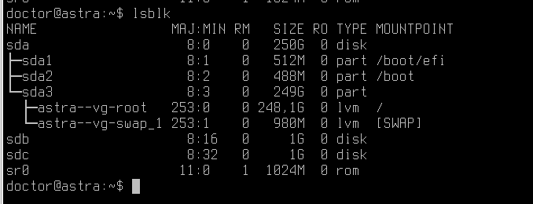

# Лабораторная работа №6. Тема: "Расширенное администрирование устройств хранения данных"

Цель работы
----------
- Изучить способы cоздания и настройки логических томов,;

- Приобрести навык создания снимков состояния;

- Выполнить создание и настройку зашифрованного раздела диска.

Оборудование, ПО:
----------

Виртуальная машина или компьютер под управлением ОС AstraLinux 1.7 в режиме защищенности "Воронеж" или выше, а также с неразмеченной областью памяти на диске.

Если работаете на виртуальной машине, просто добавьте ей дополнительный виртуальный диск объемом, как минимум в 1 гб.


Ход работы:
----------

# Начнем с терминологии.

Ядро - это часть операционной системы, которая работает скрытно от пользователя системы, ведь пользователь не работает с ядром напрямую - он взаимодействует с программами и редакторами т.д.

Ядро берет на себя задачу обеспечить работу той или иной программы. Ядро имеет доступ к аппаратной части компьютера (к процессору, оперативной памяти, устройству хранения и т.д.).




Стоит напомнить, что в Linux все драйвера и аппаратные подсистемы работают в одном адресном пространстве. Вы можете загружать и выгружать модули ядра для расширения функционала вашей операционной системы.

Чаще всего в процессе работы необходимо подключать модули драйверов устройств, поддержки криптографических алгоритмов, сетевых средств, и, чтобы уметь это правильно делать, нужно разбираться в строении ядра и уметь правильно работать с его модулями. Об этом и пойдет речь в этой лабораторной работе.

Процесс автоматической загрузки нового модуля ядра (при его наличии, конечно) во время подключения нового устройства выполняет демон - udev.

Доступные модули хранятся в каталогах:


-  **/lib/modules/<ядро_вашей_ос>** в виде файлов с расширением "ko".

-  **/lib32/modules/<ядро_вашей_ос>** в случае, если модуль ядра для х32-битной архитектуры

-  **/lib64/modules/<ядро_вашей_ос>** в случае, если модуль ядра для х64-битной архитектуры


Стоит сразу предупредить, что вам не придется искать модули ядра в разных каталогах.

Если модуль уже присутствует в каталоге /lib/modules, то в других каталогах на него будет создана символьная ссылка, для оперативного доступа и взаимодействия.


Попробуем найти модули ядра, что установлены на компьютере под AstraLinux 1.7:

```console
find /lib/modules/`uname -r` -name "*.ko"
```


В следующем материале вы познакомитесь с Расширенным администрированием устройств хранения данных!

Благодарю за чтение и успехов вам в обучении!


# Дополнительная информация:
1) Руководство администратора AstraLinux Часть 1 [Ссылка](https://astralinux.ru/products/astra-linux-special-edition/relizyi/smolensk/dokumentacziya/rukovodstvo-administratora-chast-1-astra-se.pdf)
2) Про Fstab [Ссылка](https://wiki.archlinux.org/title/Fstab_(%D0%A0%D1%83%D1%81%D1%81%D0%BA%D0%B8%D0%B9)
3) Про Fdisk [Ссылка](https://linux-faq.ru/page/komanda-fdisk)
