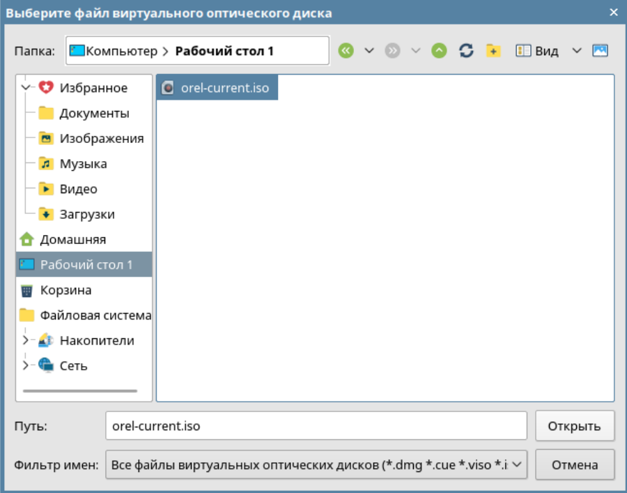

# Лабораторная работа №1. Тема: "Установка Операционной системы в виртуальной среде"
Цель работы
----------
приобрести навыки установки операционной системы;

приобрести навыки настройки операционной системы;

приобрести навыки создания виртуальных машин.

Оборудование, ПО:
----------
ISO-образ Astra Linux Орёл.

Доступ к сетевым репозиториям.

Включенная виртуализация на хостовом компьютере.

Ход работы:
----------
Astra Linux («А́стра Ли́нукс», от лат. astra — «звезда») — операционная система на
базе ядра Linux, созданная для комплексной защиты информации и построения
защищённых автоматизированных систем. Востребована в первую очередь в
российских силовых ведомствах, государственных органах и государственных
корпорациях. Обеспечивает степень защиты обрабатываемой информации до уровня
государственной тайны «особой важности» включительно. Сертифицирована в
системах сертификации средств защиты информации Минобороны, ФСТЭК и ФСБ
России. Включена в Единый реестр российских программ Минкомсвязи России.
Минимальные системные требования для работы Astra Linux Орёл с графическим
окружением:

 | **Оперативная память** | от 4 гб |
| -------------------| ------------ |
| **Объем дискового пространства**           | от 16 гб
| **Процессор**        | Архитектура x86            |

Перейдем к созданию виртуальной машины с операционной системой Astra Linux

# Это нужно знать!

---------------

**Виртуальная машина** (ВМ или VM) — это виртуальный компьютер, который
использует выделенные ресурсы реального компьютера (процессор, диск, адаптер).
Эти ресурсы хранятся локально на вычислительном устройстве и позволяют ВМ
работать автономно. Простыми словами, виртуальная машина позволяет создать на
одном компьютере ещё один компьютер, который будет использовать его ресурсы, но
работать изолированно.

Система, которая содержит и запускает образа виртуальных машин называется
**системой виртуализации** или **гипервизор**.

Гипервизоры разделяются на типы: первый и второй.

**Гипервизор первого типа** - автономный гипервизор, который устанавливается на
хостовую машину в качестве операционной системы и позволяет виртуальным
машинам обращаться к вычислительным ресурсам напрямую, без посредника в виде
основной операционной системы. Примеры: Vmware ESXi, Windows Hyper-V

**Гипервизор второго типа**- гипервизор, работающий на базе основной операционной
системы. В таком случае, виртуальные машины не имеют прямого доступа к
вычислительным ресурсам компьютера. Обращение к вычислительным ресурсам
проходит через основную ОС. Примеры: Vmware Workstation, Virtual Box.

---------------------
1)  Откройте VirtualBox на вашем рабочем месте, затем выберите параметр “Создать”

---------------------

2) На следующем этапе необходимо заполнить информацию о нашей виртуальной
машине.

**В пункте имя** - укажите желаемое имя виртуального компьютера.

**В пункте “Папка Машины”** - необходимо указать путь, где бы вы хотели расположить
системные файлы вашей виртуальной машин.

**Тип** -  указывается семейство операционной системы, которую планируете установить.

**Версия** - указывается операционная система, которую планируете установить.
Если не можете найти необходимый дистрибутив в данном списке, то можно
универсальный вариант - **Other Linux (64-bit)**, в случае если планируется установить
64-битную систему или **Other Linux (32-bit)**, в случае если планируется установить
32-битную систему

---------------------

3) На следующем этапе помощник по развертыванию виртуальной машины
потребует указать количество оперативной памяти, которую мы выделяем для
её работы. Укажем 4 ГБ.

---------------------

4) На следующем этапе необходимо указать параметры жесткого диска.

**Не подключать виртуальный жесткий диск** - создание виртуальной машины без
жесткого диска

**Создать новый виртуальный жесткий диск** - создание нового виртуального жесткого
диска для ВМ

**Использовать существующий виртуальный жесткий диск** - подключить к виртуальной
машине уже существующий жесткий диск. Это может быть полезно, если вам
необходимо создать копию ранее развернутой машины.

---------------------

5)  На следующем этапе установщик потребует указать желаемый тип
виртуального жесткого диска.

Разберемся, на что влияет выбор жесткого диска:
 * VDI (VirtualBox Image) - формат файла, разработанный Oracle для
использования в качестве образа диска в своих виртуальных машинах.
Поддерживается программой Virtual Box. Выберите данный вариант, если в
дальнейшем у вас не будет необходимости мигрировать данный образ
виртуальной машины в другие системы виртуализации.

 * VHD (Virtual Hard Disk) - формат файла, разработанный Microsoft для
использования в качестве образа диска в своих виртуальных машинах.
Поддерживается системой виртуализации Hyper-V. Выберите данный вариант,
если в дальнейшем у вас может возникнуть задача в миграции данной
виртуальной машины в систему Hyper-V.

 * VMDK (Virtual Machine Disk) - формат файла, разработанный Vmware для
использования в качестве образа диска в своих виртуальных машинах.
Поддерживается системой виртуализации Vmware ESXi и Vmware Workstation.
Выберите данный вариант, если в дальнейшем у вас может возникнуть задача в
миграции данной виртуальной машины в систему Vmware ESXi.

**В рамках нашей работы, выберем вариант VDI**

---------------------

6)  Далее система уточнит формат хранения.

Описания, представленного программой VirtualBox, вполне хватит, чтобы разобраться
в разнице этих двух дисков.

Стоит лишь добавить, что вариант с динамическим расширением работает медленнее,
так как программному обеспечению требуется постоянно увеличивать диск.

Вариант с фиксированным диском позволит вам жестко настроить количество
потребляемых ресурсов, а также ускорит работу виртуальной машины.

В рамках нашей работы выберем вариант с “Фиксированный виртуальный жесткий
диск”.

---------------------

7) Далее укажем объем диска.

**Укажите путь до той директории, где есть свободные 16 ГБ постоянной памяти.**

После настроек диска, нажимаем “Создать”.

---------------------

8)  После создания виртуальной машины нажмите “Настроить” - это необходимо
для того, чтобы примонтировать ISO-образ AstraLinux Орёл.

---------------------

9)  В “Настройках” у нас есть возможность изменить параметры нашей
виртуальной машины. Добавить дополнительную оперативную память, несколько
жестких дисков, аудио-интерфейсы, сетевые интерфейсы и т.д.

Переходим в “Носители” → “Контроллер IDE” → “Пусто” → “Атрибуты оптического
привода”.

---------------------

10) Переходим в параметр “Выбрать файл диска…”

В открывшемся окне необходимо будет перейти в папку, где хранится ISO образ
операционной системы. В нашем примере мы разместили образ на рабочем столе.

