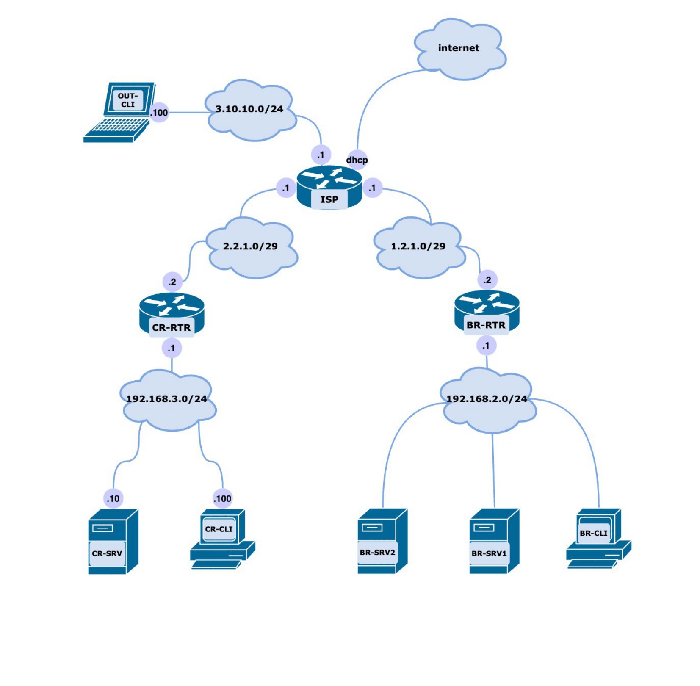
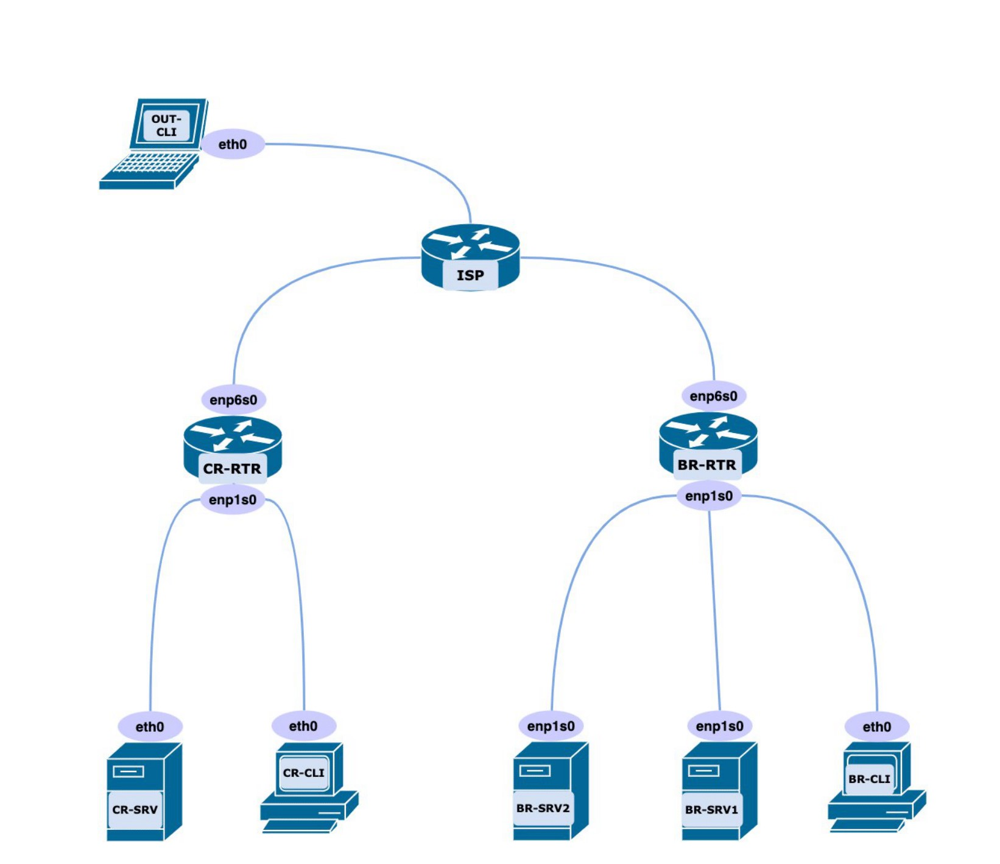

# Модуль А: «Пусконаладка инфраструктуры на основе OC семейства Linux»

# ИНСТРУКЦИИ  ДЛЯ УЧАСТНИКА

В первую очередь необходимо прочитать задание полностью.

Следует обратить внимание, что задание составлено не в хронологическом порядке. Некоторые секции могут потребовать действий из других секций, которые изложены ниже.

На вас возлагается ответственность за распределение своего рабочего времени. Не тратьте время, если у вас возникли проблемы с некоторыми заданиями. Вы можете использовать временные решения (если у вас есть зависимости в технологическом стеке) и продолжить выполнение других задач.

Рекомендуется тщательно проверять результаты своей работы.

-----

**Доступ ко всем виртуальным машинам настроен по аккаунту root:toor.**

**Если Вам требуется установить пароль, (и он не указан в задании) используйте: “P@ssw0rd”.**

**Виртуальная машина ISP преднастроена. Управляющий доступ участника к данной виртуальной машине для выполнения задания не предусмотрен. При попытке его сброса возникнут проблемы.**

**Участники не имеют права пользоваться любыми устройствами, за исключением находящихся на рабочих местах устройств, предоставленных организаторами.**

**Участники не имеют права приносить с собой на рабочее место заранее подготовленные текстовые материалы.**

**В итоге участники должны обеспечить наличие и функционирование в соответствии с заданием служб и ролей на указанных виртуальных машинах. При этом участники могут самостоятельно выбирать способ настройки того или иного компонента, используя предоставленные им ресурсы по своему усмотрению.**

**Проверка будет осуществляться по dns-именам!**

**Помните, что после окончания выполнения задания все устройства будут ПЕРЕЗАГРУЖЕНЫ!**

----

# СХЕМА ОЦЕНКИ
Каждый субкритерий имеет приблизительно одинаковый вес. Пункты внутри каждого критерия имеют разный вес, в зависимости от сложности пункта и количества пунктов в субкритерии.

Схема оценка построена таким образом, чтобы каждый пункт оценивался только один раз. Например, в секции «Базовая конфигурация» предписывается настроить имена для всех устройств, однако этот пункт будет проверен только на одном устройстве и оценен только 1 раз.

Одинаковые пункты могут быть проверены и оценены больше чем 1 раз, если для их выполнения применяются разные настройки или они выполняются на разных классах устройств.

Подробное описание методики проверки должно быть разработано экспертами, принимавшими участие в оценке конкурсного задания чемпионата, и вынесено в отдельный документ. Данный документ, как и схема оценки, является объектом внесения 30% изменений.

1.	Выполните базовую конфигурацию виртуальных машин, необходимую для сетевого взаимодействия

2.	Выполните на BR-RTR настройку DHCP-сервера для сети BR
      * Пул адресов для сети BR: 192.168.2.50-192.168.2.100
      *	В качестве DNS сервера укажите адрес BR-SRV1
      *	Сервера должны получать статические ip-адреса по dhcp
      *	Обеспечьте автоматическое обновление dns зоны rea2023.ru, в том числе статических адресов

 3. Выполните на BR-SRV1 настройку DNS сервера
      * Настройте зону rea2023.ru
      * Настройте сопоставление имен в соответствии с Таблицей 1
      * Файлы зон должны храниться в /opt/rea2023/
      * Создайте запись test.rea2023.ru, таким образом, чтобы из подсети офиса BR происходило разрешение в адрес 1.1.1.1,  а со всех остальных хостов в адрес 2.2.2.2
      * Обеспечьте подпись обновлений от DHCP сервера с использованием dnssec
      * Все запросы к домену itnsa.lab должны быть перенаправлены на 10.113.38.100

4.	На пограничных маршрутизаторах сконфигурируйте межсетевой экран при помощи пакета nftables

     * Обеспечьте возможность доступа во внешние сети всем устройствам во внутренних сетях
     * Трафик из внешних сетей не должен попадать во внутренние
     * При попытке проверки доступности любых из пограничных маршрутизаторов клиент должен получать сообщение “icmp rejected”
     * Запретите входящий трафик на все порты, кроме тех, которые используются
     * На маршрутизаторе CR-RTR сконфигурируйте перенаправление трафика с порта 2222 на стандартный ssh порт сервера CR-SRV

5.	Между пограничными маршрутизаторами организовано Site to Site VPN соединение в файле /etc/gre.up, но на данном этапе оно неработоспособно. Необходимо восстановить работоспособность соединения.

     * Известно, что соединение было защищено при помощи набора утилит strongswan. Защиту соединения необходимо сохранить.

6.	Настройте динамическую маршрутизацию по протоколу OSPF используя пакет FRR

     *  Применение статических маршрутов не допускается

7.	Разверните LDAP-сервер на базе Freeipa

     * В качестве сервера используйте CR-SRV
     * Создайте учетные записи и группы в соответствии с Таблицей 2
     * BR-CLI и CR-CLI должны аутентифицироваться через LDAP
     * В качестве имени домена LDAP используйте rea2023.ru
     * Пользователи группы branch имеют право аутентификации только на BR-CLI
     * Пользователи группы main должны иметь возможность повышать привилегии
     * Пользователи группы branch должны иметь возможность выполнять команды из списка. Доступ к другим командам необходимо ограничить:
      - **ls**
      - **grep**
      - **head**
      - **tail**

8.	Реализуйте перемещаемые профили для пользователей. При входе на другом компьютере пользователь должен получать доступ ко всем своим данным.

9.	Реализуйте общие каталоги для пользователей

     * Реализуйте папку обмена. Все пользователи имеют права чтения и записи на эту папку. Запретите пользователям удалять файлы и папки, владельцами которых они не являются. Папку необходимо смонтировать на рабочий стол, с названием Share.

     * Реализуйте папку хранения рабочих документов. Доступ для записи необходимо предоставить только группе branch, остальным пользователям разрешен доступ для чтения. Папку необходимо смонтировать на рабочий стол, с названием Docs.

10. Пользователи при входе должны автоматически получать kerberos билет

11. На сервере BR-SRV2 настройте локальный веб-сайт с содержимым

     * Сконфигурируйте ресурс https://web.rea2023.ru с содержимым “Welcome to “ReaSkills2023”

     * Сконфигурируйте ресурс https://webfiles.rea2023.ru/secret с содержимым “Welcome to our secret files!

     * При попытке доступа к корню содержимого ресурса webfiles должно происходить перенаправление на https://web.rea2023.ru

     * Сконфигурируйте аутентификацию для доступа только к разделу /secret. 

     * Аутентификация должна предусматривать доступ к ресурсу только доменных пользователей через механизм SSO. Пользователи, не являющиеся доменными, не должны иметь возможность аутентификации на ресурсе

     * При попытке доступа к ресурсу по IP адресу пользователь должен получать ошибку 404

12. На виртуальной машине OUT-CLI заполнен LVM том. Необходимо его расширить. Для расширения раздела используйте примонтированный к виртуальной машине диск /dev/vdc. Расширьте том на 50% объема нового диска.

13.	На виртуальной машине OUT-CLI создайте новый LVM том. Том должен занимать весь свободный обьем существующей группы томов.

     * Том необходимо зашифровать.

     * В качестве пароля для шифрования том используйте xxXX1122. Обеспечьте автоматическое монтирование тома при старте системы.

     * В качестве точки монтирования используйте /mnt/secured

14. На пограничном маршрутизаторе CR-RTR сконфигурируйте сервер удаленного доступа WireGuard.

15. Сконфигурируйте клиент удаленного доступа на виртуальной машине OUT-CLI. Клиент должен автоматически устанавливать соединение при загрузке системы. Обеспечьте доступ клиента к доменным ресурсам обоих офисов с использованием доменных имен. Добавьте виртуальную машину в домен.

16. На сервере BR-SRV1 реализуйте сервер сбора журналов.

     * Необходимо собрать логи уровня *.err и ниже

     * Сбор логов необходимо производить с устройств BR-RTR и CR-RTR

     * Хранить логи необходимо в /opt/logs/<hostname>/error.log

     * Реализуйте ротацию журналов. При достижении размера 10МБ, журнал необходимо архивировать. Необходимо хранить не более трех архивных копий журналов.

17. На сервере BR-SRV1 реализуйте центр сертификации.

     * В качестве CN используйте REA2023

     * В качестве корневой директории для центра сертификации используйте каталог /etc/ca

     * Все устройства должны доверять данному центру сертификации, как на уровне системы, так и в браузере Mozilla Firefox, в почтовом клиенте mozilla thunderbird.

18. На сервере BR-SRV2 реализуйте почтовый сервер

     * Соединение с почтовым сервером должно быть защищено. Клиент не должен получать ошибок в почтовом клиенте.

     * Обеспечьте возможность аутентификации с использованием доменных учетных данных.

     * 	Обеспечьте возможность отправки писем. От имени пользователя user1 на CR-CLI отправьте письмо пользователю user11 на BR-CLI

     * В качестве почтового клиента используйте Mozilla Thunderbird.

     * При входе пользователь должен указывать только свое имя и почтовый домен. Почтовый клиент не должен требовать ввода данных почтового сервера

19. На сервере BR-SRV1 разверните zabbix. Архив с заббиксом можно установить с ISP (Название архива – zabbix.zip).

     + Обеспечьте защищенное соединение, при попытке доступа по протоколу http должно происходить перенаправление на https

     + Обеспечьте аутентификацию при помощи LDAP для пользователей user1-user3

     + Сконфигурируйте мониторинг хостов BR-RTR и CR-RTR:

       * Сконфигурируйте графики потребления процессора, памяти и занятого места в корневом разделе

       * Обеспечьте агентский мониторинг

       * Соединение с заббикс-агентом должно быть защищено с использованием pre-shared key

20. На сервере BR-SRV1 разверните локальный Docker registry
     * Подключение должно быть защищено. При загрузке образов в registry не должно возникать ошибок.

21. Вам дан архив с приложением app.zip, скачать его можно с сервера ISP. В данном архиве присутствует Dockerfile с некоторыми ошибками. Необходимо выполнить сборку приложения и полученный контейнер загрузить в registry.

22.  Необходимо реализовать развертывание приложения с использованием docker compose:
     * 	Docker compose должен осуществлять запуск сервисов redis, postgresql, контейнера с приложением, обратного proxy-сервера

     * Для наполнения postgresql используйте файлы с соответствующими названиями

     * Реализуйте health-check приложения на уровне docker compose, следует проверять порт 5000

     * Доступ к приложению должен производиться через защищенное соединение

     * Реализуйте отказоустойчивость:
        * При отказе одной из реплик приложения доступ к приложению должен сохраняться

        * Минимальное количество реплик - 2

23. Настройте АТС на CR-SRV. Используйте пакет ASTERISK.

     * Используйте номера на хосте CR-CLI для пользователя User20 - 2001 , на хосте BR-CLI для пользователя User1 - 2002

     *  Ярлыки программного телефона разместите на рабочих столах указанных пользователей

     * Добавьте в контактах программного телефона номер телефона абонентов.

     * Проверьте, что звонок проходит успешно для всех пользователей.

24. Реализуйте механизм групповых политик, с помощью системы Puppet на CR-SRV. Манифесты должны выполнять задачи:

     * Распространение корневых сертификатов на подчиненные узлы:

       * При этом, система должна выполнять обновление базы данных сертификатов, только в случае если сертификат новый.

     * Создайте класс, в котором бы описывалась стандартная настройка компьютера по следующим критериям:

       * 	Использовать разные окружения - запрещено.

       * Если имя машины заканчивается на слово -cli:

        * Установка ПО - doublecmd

        * Ввод в домен

        * Создание пользователя PCAdmin с паролем P@ssw0rd  в группе astra-admin.

      * Если имя машины заканчивается на слово -srv:

         * Установка ПО - tftp, rsyslog

         * Настройка входа по ssh только пользователю root и SRVAdmin

         * Создание пользователя SRVAdmin с паролем P@ssw0rd в группе astra-admin.

      * Распространение ярлыков на рабочие места пользователей:

        * Убедитесь, что все пользователи при входе в домен получают ярлыки:

          * На веб-сервер Zabbix

          * Ярлык почтового клиента

25. Реализуйте механизм инвентаризации АРМ через Ansible на CR-SRV:

      * Плейбук должен собирать информацию о рабочих местах:
       *	Имя компьютера

       * Версию ПО - DoubleCmd, Firefox. Если ПО отсуствует, плейбук в отчете уведомит об этом фразой - “Программа не установлена”

       * IP-адрес на компьютере

       * Отчеты, собранные с машин должны быть размещены в том же каталоге на сервере, где и плейбук в папке ARM_INFO, в формате .yml. Файл называется именем компьютера, который был инвентаризован.

       * Все файлы разместите в /etc/ansible

# Таблица 1

| Имя | Тип записи | Адрес |
| --- | ---------- | ----- |
| br-rtr.rea2023.ru | A, PTR | 192.168.2.1 |
| br-cli.rea2023.ru  | A | DHCP |
| br-srv1.rea2023.ru  | A,PTR | DHCP |
| br-srv2.rea2023.ru  | A,PTR | DHCP |
| cr-rtr.rea2023.ru  | A,PTR | 192.168.3.1 |
| cr-cli.rea2023.ru  | A | 192.168.3.100 |
| cr-srv.rea2023.ru  | A,PTR | 192.168.3.10 |
| test.rea2023.ru  | A | 1.1.1.1, 2.2.2.2 |
| web.rea2023.ru  | CNAME | br-srv2.rea2023.ru |
| webfiles.rea2023.ru  | CNAME | br-srv2.rea2023.ru |
| mail.rea2023.ru  | MX | br-srv2.rea2023.ru |
| app.rea2023.ru  | A | DHCP |
| registry.rea2023.ru  | A | br-srv1.rea2023.r |
| zbx.rea2023.ru  | A | br-srv1.rea2023.r |

# Таблица 2

| Имя пользователя | Пароль | Группы | Хост |
| ---------------- | ------ | ------ | ---- |
| user1-10 | P@ssw0rd | branch | BR-CLI |
| user11-20 | P@ssw0rd | main | all |
| user21-30 | P@ssw0rd | external users | - |

*подразумевается 30 пользователей в общем количестве

# Характеристики ВМ

| ВМ | ОС |
| -- | -- |
| OUT-CLI,BR-CLI,CR-CLI,CR-SRV | AstraLinux Орёл 1.7 |
| BR-RTR,BR-SRV1,BR-SRV2,CR-RTR,ISP | Debian 11 |

# Топология L3

# Топология L2

